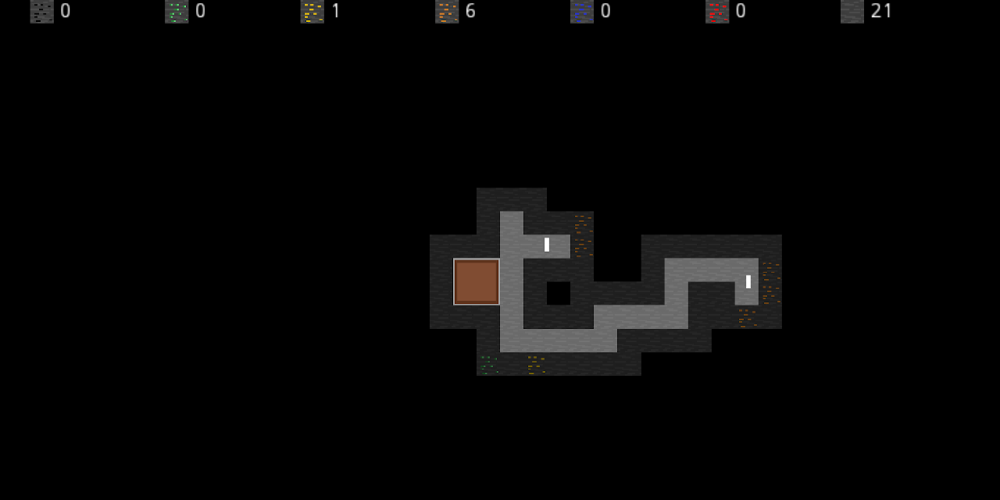

# Gruvkartong

Copyright(C) 2020 Johan Thelin

A game inspired by the amazing rymdkapsel.

# Instructions

Currently you cannot do much. The idea is to create a resource mining, refining and exploration game.

## Input

- Left mouse button selects areas to dig. These have to be adjecent to a corridor (not diagonally).
- Right mouse button attempts to build a 2x2 building.

# Todo

- The game currently contains minecraft assets - hence the private repo
- Buildings!
- Doing stuff with buildings.
- Tearing down buildings.
- Assigning minions to tasks.
- Goblins.
- Non-hardcoded minions.

## Building logic

The issue right now is that you can only dig a corridor from another corridor - so by building buildings all around yourself, you can effictively get yourself in a situation where you cannot dig any more.

This needs to be handled by restricting the building placement.

Also, navigation wise, the minions currently are allowed to move through the buildings (due to the navigation overlay on the texture). This is not right - the minions should move to the edge of a building, then into the building if they are assigned to it.
